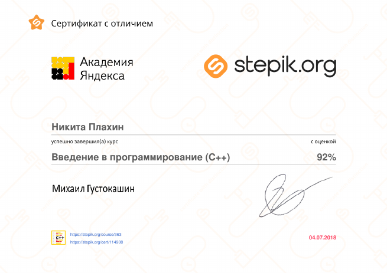

# Curriculum vitae

## Nikita Plakhin

## You can contact me using following means:
* Telegram: +375 (33) 387-06-26
* VK: vk.com/nplkhn
* Skype: nplkhn1
* Phone: +375 (33) 387-06-26

## Something about me
I am cheerful and very responsible person. I can easily adapt to any conditions and I am fast learner. I have a mathematical mindset and since childhood "learned to learn". I like to solve interesting problems. I am interested in everything that surrounds me. I don't have much knowledge but I have a great desire to learn. I like to communicate with new people.

## Skills
* PHP -- 1 semester
* C++ —- 2 years in the University
* MySQL —- 1 semester
* SQL —- 1 semester

## Experience
I don't have any experience, but hope to get it in your company:)

## Education
I am a 2nd year student of the Belarusian state University of Economics. Passed the course "Introduction to C++" from the Yandex Academy on the website stepik.org

## English level
I can't say that I know English well, but I do my best to improve my knowledge. Listening to music in English and try to understand the meaning of the song without any translation. Taking courses on duolingo.
